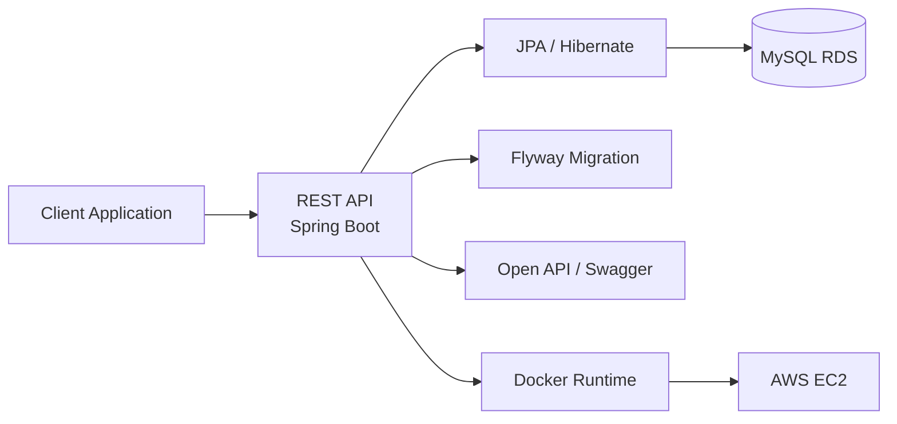

# DOHYUN PARK
## Enterprise Backend Engineer

`To iterate is human, to recurse divine.`

---

## Philosophy

I focus on how technology sustains real business operations.  
Beyond individual features, I design backend systems around data flow, process consistency, and enterprise-scale reliability.

---

## Core Tech Stack

| Domain | Technologies | Selection Rationale |
|---|---|---|
| Backend | Java, Spring Boot, JPA, Hibernate | Structured business logic design, stable transaction handling, and enterprise-grade REST API architecture |
| Database | MySQL, SQL, Database Modeling | Data integrity-oriented schema design and query optimization for operational reliability |
| Infrastructure | AWS EC2, Docker, Flyway, GitHub CI/CD, Swagger | Repeatable deployment, migration control, and maintainable API documentation workflow |
| Enterprise | ERP Systems, SAP Ecosystem | Business process understanding across finance/operations and system-level process alignment |

---

## Enterprise Systems

| Project | Challenge Solved | Architecture Focus | Repository / Docs |
|---|---|---|---|
| 대학물품관리관리시스템 | Lack of centralized ownership and lifecycle control for organization-wide assets | Spring Boot API + JPA/Hibernate + MySQL(RDS) + Docker + AWS + Flyway | [Repository](https://github.com/U-sto/U-sto_BE) / [API Docs](http://13.124.10.41:8080/swagger-ui/index.html#/) |
| 스마트 전자결재 시스템 (Planned) | Hardcoded approval logic causing scalability and process rigidity | Dynamic approval routing + workflow-oriented backend API design | Planned |
| 전사적 데이터 통합 플랫폼 (Planned) | Data silo and inconsistency across internal/external business systems | Scheduled synchronization + standardized REST API for ERP/SAP integration | Planned |

---

## System Architecture Preview

---

## Technical Data Sheet

| Category | Value |
|---|---|
| Name | 박도현 (Dohyun Park) |
| Target Role | Enterprise Backend Engineer |
| Core Domain | ERP / SAP / Enterprise Data Flow |
| Email | badberg2002@gmail.com |
| Portfolio | [parkdohyun.com](https://parkdohyun.com) |
